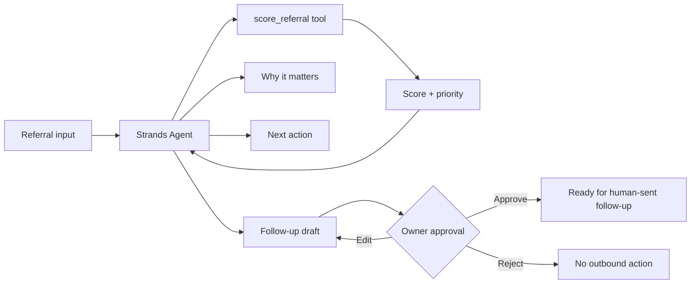

# Hospitality Referral Agent

**Turn referrals into follow-ups.**

Hospitality Referral Agent is a human-in-the-loop AI agent for hospitality and food businesses. It takes a referral, evaluates its priority, explains why it matters, recommends the next action, and drafts a follow-up for owner approval. It never auto-sends outreach.

This dedicated competition repository implements the vertical slice with the **AWS Strands Agents SDK** for the **Professional Agents** track of the AWS Agents for Humans Hackathon.

## Problem

Hospitality operators often receive referrals through conversations, events, customers, vendors, and partners. Those opportunities can be lost because owners are busy operating the business and do not have time to consistently prioritize and follow up.

Hospitality Referral Agent turns a referral record into an actionable, explainable follow-up workflow while keeping the business owner in control.

## What the agent does

1. Accepts a hospitality referral.
2. Uses a Strands tool to score the referral across five transparent factors.
3. Returns HIGH / MEDIUM / LOW priority and a 0–100 score.
4. Explains the strongest reasons for the score.
5. Recommends one next action and timing.
6. Drafts a concise follow-up.
7. Stops at an explicit **OWNER APPROVAL REQUIRED** checkpoint.

No email, SMS, voice call, or other outbound communication is sent automatically.

## Built With

- **AWS Strands Agents SDK** — agent orchestration and tool use
- **Amazon Bedrock** — default Strands model provider
- Python 3.10+
- Pytest
- GitHub Actions

## Architecture



See [`docs/architecture.md`](docs/architecture.md) for the detailed architecture and scope boundary.

## Competition package

- [`docs/submission-package.md`](docs/submission-package.md) — Devpost-ready project story, requirements checklist, and submission copy
- [`docs/judge-readiness.md`](docs/judge-readiness.md) — AIZOYA OS 2.0 review against all five judging dimensions
- [`docs/demo-script.md`](docs/demo-script.md) — under-five-minute demonstration sequence
- [`docs/aws-evening-runbook.md`](docs/aws-evening-runbook.md) — safe Bedrock validation and AgentCore decision sequence
- [`docs/public-demo-deployment.md`](docs/public-demo-deployment.md) — GitHub Pages deployment and QA runbook
- [`SECURITY.md`](SECURITY.md) — competition security and public-demo guardrails

## Quick start

Requirements: Python 3.10+ and, for live agent inference, AWS credentials with access to an Amazon Bedrock model supported by Strands.

```bash
python -m venv .venv
source .venv/bin/activate
pip install -r requirements.txt
pytest -q
```

### Static public judge demo

`docs/index.html` is a Pages-ready interactive demo. It runs entirely in the browser using synthetic data and the deterministic scoring formula. It makes no AWS or network requests.

This is the recommended public **Try it** surface after GitHub Pages is enabled from `main` → `/docs`.

### Local judge-facing browser demo

Run the zero-dependency browser interface in its default offline-safe mode:

```bash
python -m scripts.run_web_demo
```

This exposes **Analyze referral offline** only. The deterministic path requires no AWS credentials and cannot create model-invocation cost.

For a controlled local or protected judging session after AWS access is confirmed, explicitly enable the live Strands + Bedrock action:

```bash
python -m scripts.run_web_demo --enable-live
```

The live action invokes the real Strands agent through Amazon Bedrock. Do not expose unrestricted public Bedrock invocation with project credentials; see `SECURITY.md`.

Both execution modes preserve the **OWNER APPROVAL REQUIRED** boundary and never send outreach.

### CLI demos

Run the deterministic score-only demo without AWS credentials:

```bash
python -m scripts.run_demo --score-only
```

Run the full Strands agent using the included sample referral:

```bash
python -m scripts.run_demo
```

Run the final one-command AWS/Bedrock validation:

```bash
python -m scripts.live_validation --region us-west-2
```

Optionally specify a Bedrock model ID:

```bash
python -m scripts.run_demo --model YOUR_BEDROCK_MODEL_ID
```

## Example referral

The included `examples/sample_referral.json` represents an Oakland event venue referred by an existing client with an urgent catering-partner need. The deterministic scoring tool assigns transparent component scores before the Strands agent generates its reasoning and draft.

## Safety and human control

The vertical slice has a hard product boundary:

- analysis is allowed
- prioritization is allowed
- next-action recommendations are allowed
- drafting is allowed
- **sending is not allowed**
- **owner approval is mandatory**

The agent prompt also forbids claiming that outreach was sent, scheduled, called, or delivered.

The browser demo is offline-safe by default. Live Bedrock invocation must be explicitly enabled for a controlled session, oversized requests are rejected, and user-facing errors do not expose raw infrastructure exceptions.

The static public judge demo makes no network requests and cannot invoke Bedrock.

## Tests

The test suite verifies:

- high-priority referral scoring
- medium-priority scoring
- low scores for incomplete records
- owner approval is always required
- outbound status remains draft-only
- live validation stops when AWS preflight fails
- live validation proceeds only after a successful preflight
- browser demo preserves the human-approval checkpoint
- offline browser analysis remains credential-free
- live browser invocation is disabled by default
- static public demo contains safety markers and no network API calls

CI runs the tests and a deterministic smoke demo on every pull request and on the competition branch.

## Competition scope

This repository intentionally keeps the hackathon slice narrow. The following are not part of this version:

- automated outreach
- Twilio calling
- full CRM/dashboard expansion
- multi-tenant product expansion
- referral payouts
- sponsor intelligence

AgentCore is an optional scoring and learning enhancement. It will be evaluated only after the core Strands workflow, live Bedrock validation, tests, and judge-facing demo are proven stable. The non-AgentCore path remains the rollback-safe baseline.

## License

MIT — see [`LICENSE`](LICENSE).
