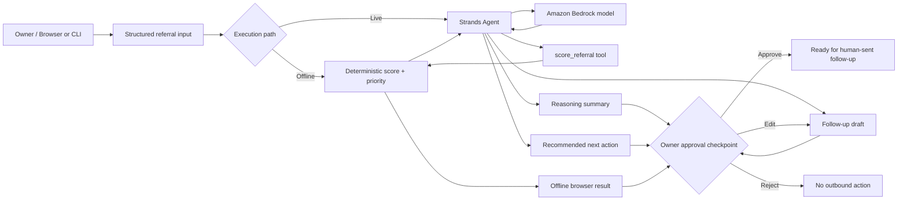

# Hospitality Referral Agent — Architecture

## Competition vertical slice

## Components

### User input and interfaces

The competition slice supports two judge-facing interfaces:

- `scripts/run_web_demo.py` — zero-dependency browser surface for product demonstration
- `scripts/run_demo.py` — reproducible CLI runner for development and fallback demonstration

Both consume structured referral data and preserve the same human-approval boundary.

### Offline deterministic path

The browser demo can score a referral without AWS credentials. This path proves the transparent business logic, component scoring, priority classification, and draft-only safety boundary even if cloud access is unavailable during judging.

### Live Strands agent path

`src/referral_agent.py` constructs a `strands.Agent` with a hospitality-specific system prompt and the `score_referral` tool. The agent uses the Bedrock-backed model, calls the scoring tool before assigning priority, interprets the tool result, recommends timing and next action, and prepares the owner-facing draft.

### Scoring tool

The scoring tool converts the referral into five transparent scoring components:

- need / intent: 30 points
- referral quality: 20 points
- urgency: 20 points
- business fit: 20 points
- contact completeness: 10 points

Priority thresholds are HIGH >= 80, MEDIUM >= 60, otherwise LOW.

### AWS services

Amazon Bedrock is the model provider for the live Strands run. AWS credentials and Bedrock visibility can be checked using the read-only `scripts/aws_preflight.py` helper before model invocation. AgentCore remains an optional post-baseline enhancement.

### Output

The live agent returns five owner-facing sections: PRIORITY, WHY, NEXT ACTION, DRAFT, and APPROVAL STATUS. The offline interface exposes the deterministic score, priority, component factors, recommended timing, and the same approval-required status.

### Human approval boundary

The agent may analyze, prioritize, explain, recommend, and draft. It may not send, schedule, call, or otherwise perform outbound communication. Every generated follow-up is explicitly draft-only and requires owner approval.

## Deliberately outside this vertical slice

- automated SMS/email/voice sending
- Twilio integration
- full CRM/dashboard expansion
- multi-tenant UI
- referral payouts
- sponsor intelligence

AgentCore may be evaluated after the core Strands + Bedrock workflow runs successfully and the competition submission requirements are stable. The non-AgentCore path remains the rollback-safe baseline.
