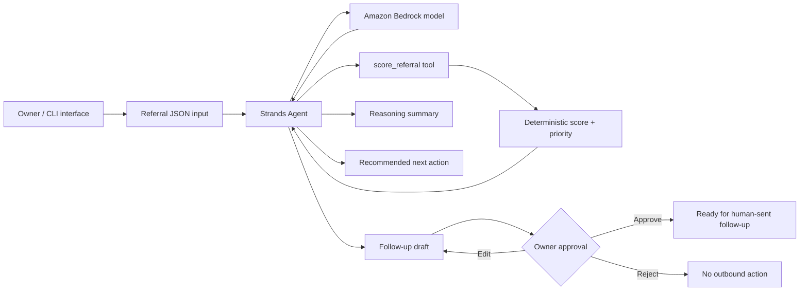

# Hospitality Referral Agent — Architecture

## Competition vertical slice

## Components

### User input / interface
The competition slice uses a CLI runner (`scripts/run_demo.py`) with a structured JSON referral as input. This keeps the demo reproducible while proving the complete workflow.

### Strands agent and agentic loop
`src/referral_agent.py` constructs a `strands.Agent` with a hospitality-specific system prompt and the `score_referral` tool. The agent uses the Bedrock-backed model, calls the scoring tool before assigning priority, interprets the tool result, and returns the owner-facing response.

### Scoring tool
The scoring tool converts the referral into five transparent scoring components:

- need / intent: 30 points
- referral quality: 20 points
- urgency: 20 points
- business fit: 20 points
- contact completeness: 10 points

Priority thresholds are HIGH >= 80, MEDIUM >= 60, otherwise LOW.

### AWS services
Amazon Bedrock is the model provider for the live Strands run. AWS credentials and Bedrock visibility can be checked using the read-only `scripts/aws_preflight.py` helper before model invocation.

### Output
The agent returns five owner-facing sections: PRIORITY, WHY, NEXT ACTION, DRAFT, and APPROVAL STATUS.

### Human approval boundary
The agent may analyze, prioritize, explain, recommend, and draft. It may not send, schedule, call, or otherwise perform outbound communication. Every generated follow-up is explicitly draft-only and requires owner approval.

## Deliberately outside this vertical slice

- automated SMS/email/voice sending
- Twilio integration
- full CRM/dashboard expansion
- multi-tenant UI
- referral payouts
- sponsor intelligence
- AgentCore deployment

AgentCore can be evaluated after this core Strands workflow runs successfully and the competition submission requirements are complete.
